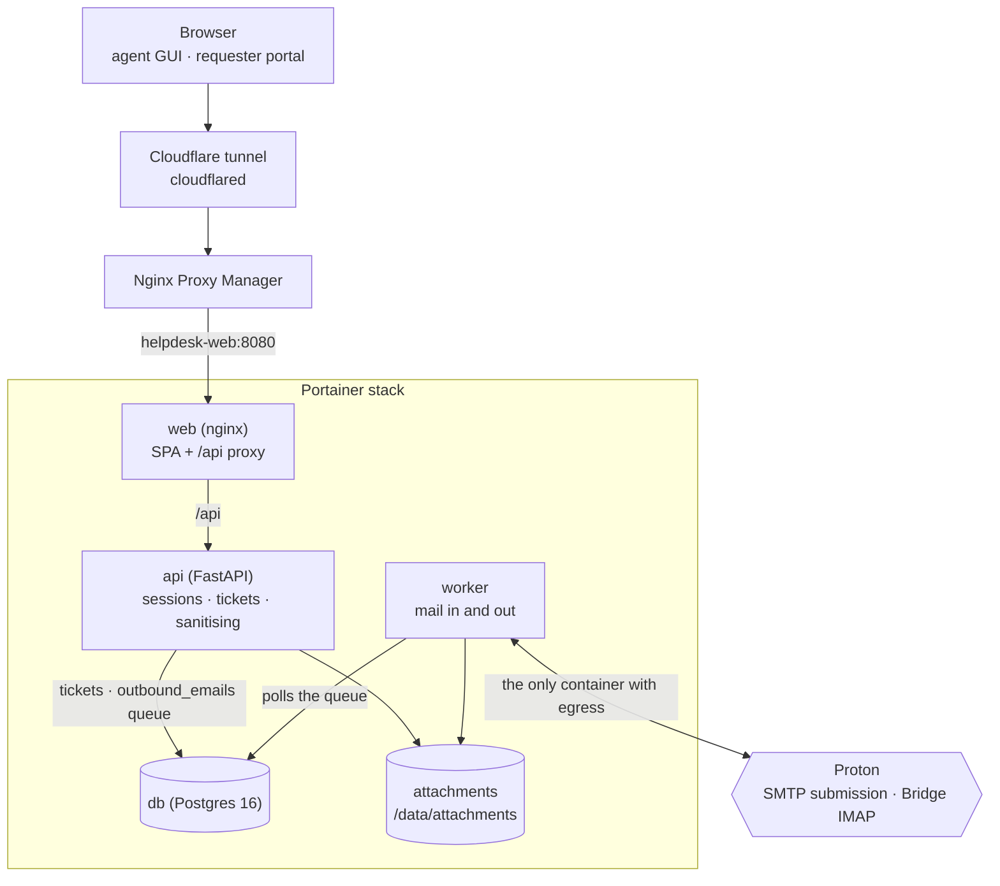

# jward-helpdesk

A self-hosted helpdesk for a homelab: a web GUI for raising and working tickets,
plus a real email loop so people can just reply to the mail they were sent and
have it land on the right ticket.

Runs as a Portainer stack behind Nginx Proxy Manager, which sits behind a
Cloudflare tunnel. Nothing is published on a host port.

## Architecture



## What it does

**Sign-in**
- Email and password (Argon2id), with a length and complexity policy
- TOTP multi-factor, mandatory for agents and admins by default
- Ten single-use recovery codes, shown once at enrolment
- Server-side sessions with idle and absolute timeouts, revocable from the GUI

**Tickets**
- Pick a template when raising a ticket; each defines its own fields. The
  defaults are household ones — something not working, Wi-Fi, media server,
  login help, asking for something
- Emailed-in tickets get the fallback template, and you re-template them in
  the GUI afterwards
- Statuses, priorities, assignment, internal notes, full audit trail
- Requesters see only their own tickets, and never internal notes

**Email**
- Replies you write in the GUI are emailed to the requester
- Their answer is logged against the same ticket instead of creating a new one,
  and shows in their portal view too
- Images and files attached to an email become attachments in the GUI; inline
  images render in the message body
- Remote images are stripped, so tracking pixels do not fire

## Quick start

### Portainer (how this is meant to run)

1. **Stacks → Add stack → Repository**, pointed at this repo, compose path
   `docker-compose.yml`.
2. Fill the **Environment variables** pane from [`.env.example`](.env.example).
   Generate every secret yourself:

   ```bash
   # run once per secret
   openssl rand -hex 32
   ```

   ```powershell
   # PowerShell 7 - run once per secret
   # 32 cryptographically random bytes as 64 hex chars, same as `openssl rand -hex 32`.
   # Get-Random is not a CSPRNG, so do not substitute it here.
   [Convert]::ToHexString([System.Security.Cryptography.RandomNumberGenerator]::GetBytes(32)).ToLower()
   ```

3. Deploy. On first boot the API creates the schema, seeds the default
   templates, and creates the admin from `BOOTSTRAP_ADMIN_EMAIL` /
   `BOOTSTRAP_ADMIN_PASSWORD`.
4. Set `PROXY_NETWORK` to your Nginx Proxy Manager network and add a proxy
   host in NPM pointing at `helpdesk-web:8080`
   (see [docs/reverse-proxy.md](docs/reverse-proxy.md)).
5. Sign in. You are made to change the password and enrol MFA immediately.
6. **Clear `BOOTSTRAP_ADMIN_PASSWORD` from the stack environment and redeploy.**
   It is only read when no admin exists, but there is no reason to leave a
   password sitting in the stack definition.

### Local development

```bash
# bash - backend
cd backend
python3 -m venv .venv && source .venv/bin/activate
pip install -r requirements-dev.txt
cp ../.env.example ../.env   # set APP_ENV=dev, SESSION_COOKIE_SECURE=false
uvicorn app.main:app --reload

# frontend, in a second terminal
cd frontend && npm install && npm run dev   # http://localhost:5173
```

```fish
# fish - backend
cd backend
python3 -m venv .venv; and source .venv/bin/activate.fish
pip install -r requirements-dev.txt
uvicorn app.main:app --reload
```

`APP_ENV=dev` relaxes the production guard rails (it allows `http://`
and a non-Secure cookie) and mounts the API docs at `/api/docs`. Never run a
tunnelled deployment with it.

## Configuration

Everything comes from the environment; there is no config file to edit.
[`.env.example`](.env.example) is the full list, with comments. The ones worth
understanding:

| Variable | Why it matters |
| --- | --- |
| `APP_SECRET` | Signs sessions, CSRF tokens and mail reply tokens, and encrypts TOTP seeds. Rotating it signs everyone out and breaks stored TOTP secrets. |
| `PUBLIC_BASE_URL` | Must be the `https://` origin people actually use. In `prod` the app refuses to start on `http://`. |
| `SMTP_FROM_EMAIL` | With Proton SMTP submission this must be the exact address the token was issued for, or Proton rejects the mail. |
| `PROXY_NETWORK` | The docker network your Nginx Proxy Manager runs on, so it can reach `helpdesk-web:8080`. |
| `REQUIRE_MFA_FOR_AGENTS` | Forces MFA enrolment for agents and admins at first sign-in. Leave it on. |
| `TRUST_CLOUDFLARE_HEADERS` | Trusts `CF-Connecting-IP` for rate limiting. Only correct when the tunnel is the *only* route in. |

In `prod` the app refuses to start on a placeholder `APP_SECRET`, a non-HTTPS
`PUBLIC_BASE_URL`, or `SESSION_COOKIE_SECURE=false`.

## How email threading works

The ticket reference never goes in the email address — plus-addressing is not
reliable across providers. It rides in the subject and in the body footer, and
is signed with an HMAC over the ticket number and a random per-ticket token:

```
Subject: [TKT-1042-9f3c1ab27d0e] Netflix keeps buffering
...
[ref:1042-9f3c1ab27d0e]
```

An inbound message is matched by the first of these that hits:

1. **Signed subject tag** — survives an ordinary `Re:` reply.
2. **Signed body reference** — found anywhere in the raw body, including the
   quoted history, so it survives a rewritten subject.
3. **Threading headers** — `In-Reply-To` / `References` matched against the
   `Message-ID`s we sent or previously ingested.
4. **Bare subject tag** — `[TKT-1042]` with no signature, accepted *only* when
   the sender is already the requester, staff, or an existing participant.
   Ticket numbers are sequential, so on its own a tag never grants access.

Anything unmatched becomes a new ticket on the fallback template. Messages are
recorded by `Message-ID`, so re-reading a mailbox cannot duplicate a ticket, and
unmatched auto-replies are dropped rather than starting a mail loop.

Full detail — including Proton SMTP submission, Proton Bridge for receiving,
and what to do when replies land as new tickets — is in
[docs/email.md](docs/email.md).

## Repository layout

```
backend/           FastAPI application
  app/api/         HTTP routes
  app/services/    tickets, templates, mail in/out, sanitising, storage
  app/security/    passwords, TOTP, sessions, CSRF, rate limits, mail tokens
  app/workers/     IMAP poller and outbound sender
  tests/           124 tests, no containers needed
frontend/          React + TypeScript SPA, served by nginx
docs/              deployment, email, security hardening, Cloudflare tunnel
docker-compose.yml Portainer stack
```

## Testing

```bash
cd backend && pytest                 # 124 tests, SQLite-backed
cd backend && ruff check .
cd frontend && npm run build         # type-checks as part of the build
```

The suite covers email parsing and threading, the routing rules above
(including forged signatures and strangers guessing ticket numbers),
sanitising, storage, password and TOTP handling, mail TLS, rate limiting, CSRF,
and the ticket/permission API.

## Documentation

- [docs/deployment.md](docs/deployment.md) — Portainer stack, upgrades, backups
- [docs/email.md](docs/email.md) — Proton setup, threading, troubleshooting
- [docs/security.md](docs/security.md) — what is defended and how
- [docs/reverse-proxy.md](docs/reverse-proxy.md) — NPM, the tunnel, Access
- [SECURITY.md](SECURITY.md) — reporting a vulnerability
- [CLAUDE.md](CLAUDE.md) — conventions for working in this repo

## Licence

[MIT](LICENSE)
